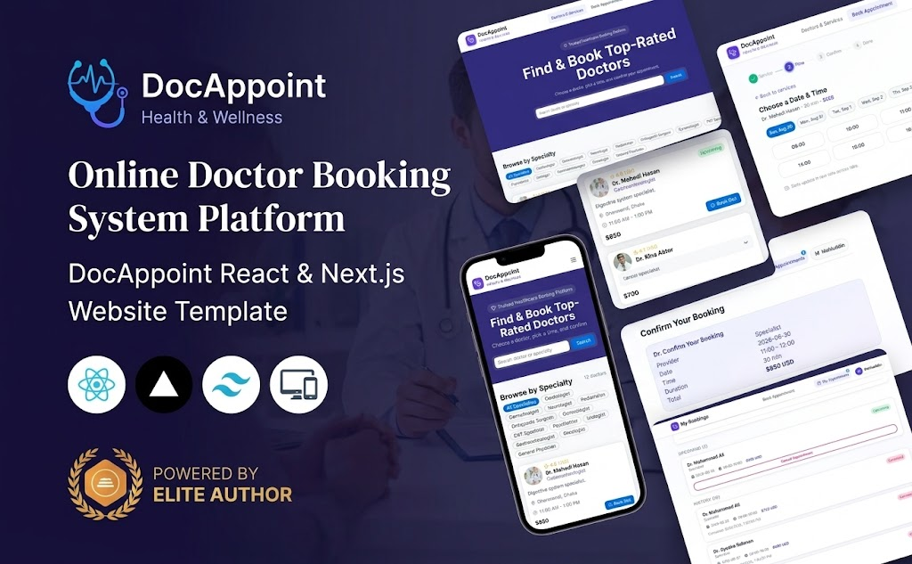

# ServiceSlot

A responsive appointment-booking application for finding a doctor or service, choosing an available date and time, and managing appointments in one place.

Built as a frontend internship project with **Next.js**, **TypeScript**, and **Tailwind CSS**.

## Live Demo

[https://doc-appoint-omega.vercel.app/](https://doc-appoint-omega.vercel.app/)



## Features

- Browse doctors and services with key details such as specialty, fee, experience, and availability.
- Search by doctor name or specialty.
- Select a service, date, and available time slot through a guided booking flow.
- Validate customer name, email address, and phone number before confirming a booking.
- Prevent a booked slot from being selected again; cancelling an upcoming appointment releases that slot.
- View upcoming and cancelled appointments from **My Appointments**.
- Load current appointment and availability data from the backend.
- Register and sign in with email and password.
- Responsive interface for mobile and desktop screens.

## Tech Stack

- [Next.js 16](https://nextjs.org/)
- [React 19](https://react.dev/)
- [TypeScript](https://www.typescriptlang.org/)
- [Tailwind CSS](https://tailwindcss.com/)
- [Zustand](https://zustand.docs.pmnd.rs/) for client-side state
- [HeroUI](https://www.heroui.com/) for UI components
- Better Auth and MongoDB for authentication and appointment data

## Pages

| Route | Description |
| --- | --- |
| `/` | Doctor/service catalogue with search and specialty filtering. |
| `/booking` | Step-by-step service, date/time, and booking-form flow. |
| `/appointments` | Upcoming and past appointment history with cancellation. |

## Getting Started

### 1. Clone the repository

```bash
git clone https://github.com/mohiuddinshanto/doc_appoint.git
cd doc_appoint
```

### 2. Install dependencies

```bash
npm install
```

### 3. Add environment variables

Create a `.env.local` file in the project root. Do not commit this file.

```env
NEXT_PUBLIC_BACKEND_URL=https://your-backend-url.vercel.app
BETTER_AUTH_URL=http://localhost:3000
BETTER_AUTH_SECRET=replace-with-a-secure-random-secret
MONGODB_URI=mongodb+srv://<username>:<password>@<cluster-url>/
MONGODB_DB_NAME=docappoint_db
```

For a deployed application, set `BETTER_AUTH_URL` to the frontend's production URL and add the same variables in the Vercel project settings.

### 4. Start the development server

```bash
npm run dev
```

Open [http://localhost:3000](http://localhost:3000) in your browser.

## Available Scripts

```bash
npm run dev     # Start the development server
npm run build   # Create an optimized production build
npm run start   # Start the production server
npm run lint    # Run ESLint
```

## Project Structure

```text
app/                 # App Router pages and authentication route
components/          # Reusable booking, appointment, home, and UI components
lib/                 # Authentication, API, mock-slot, and utility functions
store/               # Zustand stores for services, auth, and bookings
types/               # Shared TypeScript interfaces and types
public/Images/       # Project screenshots
```

## Booking Rules

Each appointment is identified by a combination of service, date, and slot. Once a booking is confirmed, the matching slot is marked unavailable immediately. When an upcoming appointment is cancelled, its slot becomes selectable again.

## Author

**Mohiuddin Shanto**<br>
Frontend Development Intern Candidate
